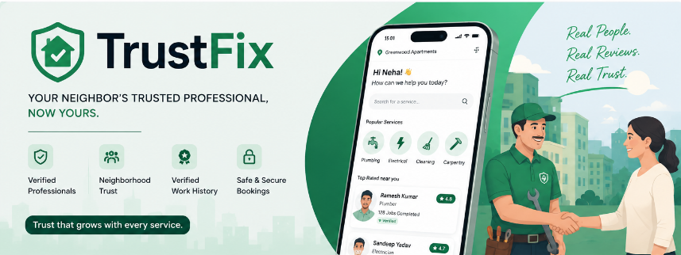

<p align="center">
  
</p>

<h1 align="center">TrustFix</h1>

<p align="center">
<b>Designing a Trust-First Home Services Marketplace for India</b>
</p>

<p align="center">
Transforming neighborhood trust into a scalable digital reputation system for home service professionals.
</p>

<p align="center">

    


</p>

---

<p align="center">

<a href="https://trust-fix-pwa.vercel.app">

</a>

<a href="docs/TrustFix_Presentation.pdf">

</a>


<a href="#product-overview">

</a>

</p>

---

# Product Overview

TrustFix is an end-to-end Product Management case study that explores how trust can become a competitive advantage in India's fragmented home services market.

Instead of creating another marketplace where every customer starts from scratch, TrustFix proposes a neighborhood-first ecosystem where verified work builds a portable reputation over time. Every completed service strengthens a professional's credibility, allowing future customers to make more confident booking decisions.

The project covers the complete product lifecycle-from problem discovery and user understanding to MVP prioritization, UX design, go-to-market planning, success metrics, and an interactive prototype.

This repository showcases both the product thinking and the implementation behind the solution.

---

# Table of Contents

- Product Overview
- Problem Statement
- Existing Market
- Key Product Insight
- Product Vision
- User Personas
- Solution Overview
- Product Architecture
- Customer Journey
- Provider Journey
- MVP Prioritization
- Go-To-Market Strategy
- Success Metrics
- Risks & Trade-offs
- Interactive Prototype
- Tech Stack
- Repository Structure
- Key Learnings
- Future Roadmap

---

# Why This Project Exists

Booking a home service professional should be simple.

In reality, it rarely is.

Imagine discovering an excellent plumber through your apartment WhatsApp group. The service is completed successfully, and the issue is resolved.

A few months later, another resident faces the same problem.

The recommendation is buried somewhere in hundreds of chat messages.

The professional's credibility exists only in someone's memory.

The trust earned from previous work disappears.

This pattern repeats every day across thousands of neighborhoods.

Customers continue relying on fragmented referrals, while skilled professionals struggle to build credibility beyond their immediate customer base.

Current marketplaces solve discovery reasonably well, but they still struggle to solve the deeper problem:

> **Trust is created during every successful service, but it rarely compounds afterwards.**

TrustFix was designed around a simple question:

> **How might we design a marketplace where trust grows stronger after every completed job instead of resetting for every new customer?**

---

# The Problem Statement

The Indian home services ecosystem suffers from two interconnected challenges.

## For Customers

- Difficulty identifying trustworthy professionals
- Heavy dependence on informal referrals
- Uncertainty around service quality
- Lack of pricing transparency
- Limited accountability after booking
- Inconsistent customer experience

## For Service Professionals

- Difficulty building long-term credibility
- Heavy dependence on word-of-mouth
- Irregular job opportunities
- Poor customer retention
- Limited visibility outside existing networks

Both sides face the same underlying issue:

**Trust does not scale.**

---

# Existing Market

Today, customers typically discover service professionals through one of four channels.

| Channel | Strength | Limitation |
|----------|-----------|------------|
| Word of Mouth | High trust | Limited reach |
| WhatsApp Groups | Local recommendations | Information quickly disappears |
| Online Listings | Large supply | Difficult to verify quality |
| Marketplace Apps | Convenience | Reputation remains platform-specific |

Each solution solves only part of the problem.

None effectively preserve and compound neighborhood trust over time.

---

# Key Product Insight

After studying the problem, one insight became clear.

> **People are not looking for the cheapest plumber.**
>
> **They are looking for the plumber they can trust.**

Every successful home service already creates trust.

The problem is not generating trust.

The problem is preserving it.

Instead of repeatedly rebuilding confidence from scratch, TrustFix transforms every verified service into a reusable reputation signal that benefits future customers within the same neighborhood.

This shifts trust from being an isolated transaction to becoming a community asset.

---

# Product Vision

> **To build India's most trusted neighborhood-first home services marketplace where every verified service strengthens both customer confidence and provider credibility.**

The product aims to make discovering reliable professionals as easy as asking a trusted neighbor while maintaining the convenience and scalability of a digital marketplace.

---

# Product Principles

Before proposing any features, I defined a set of product principles that would guide every design decision throughout the project.

These principles acted as constraints, ensuring the product remained focused on solving the core trust problem instead of becoming another feature-heavy marketplace.

---

## Principle 1 - Trust Before Growth

Most marketplaces prioritize increasing transactions.

TrustFix prioritizes increasing customer confidence.

The assumption is simple:

> Sustainable growth follows when users consistently trust the platform.

Every feature included in the MVP was evaluated based on one question:

**Does this increase user trust?**

If not, it was excluded.

---

## Principle 2 - Reduce Friction

Many home service customers are first-time or infrequent users.

The booking experience should require as little effort as possible.

Instead of forcing users to install another application, TrustFix uses **WhatsApp as the primary acquisition channel** and transitions users into a lightweight Progressive Web App (PWA) only when necessary.

This minimizes onboarding friction while maintaining a rich product experience.

---

## Principle 3 - Reputation Should Compound

Every completed job creates trust.

Unfortunately, that trust usually remains locked between one customer and one provider.

TrustFix transforms verified service history into a reusable reputation system that benefits future customers within the same neighborhood.

Trust should become stronger after every completed service-not disappear.

---

## Principle 4 - Build for Both Sides of the Marketplace

Marketplace success depends on balancing two user groups:

- Customers
- Service Professionals

Improving the customer experience while neglecting providers creates supply problems.

Supporting providers while ignoring customer trust reduces demand.

Every feature was evaluated from both perspectives before being included in the MVP.

---

## Principle 5 - Keep the MVP Simple

Engineering resources are limited.

The first version of the product should validate the core hypothesis rather than solve every marketplace problem.

Only features directly supporting trust, booking, and service completion were included in the MVP.

Everything else was intentionally deferred.

---

# Success Criteria

The proposed solution would be considered successful only if it could achieve the following outcomes.

### Customer Outcomes

- Higher confidence while booking services
- Reduced dependence on informal referrals
- Better transparency during service delivery
- Improved booking experience

### Provider Outcomes

- Stronger professional credibility
- More consistent job opportunities
- Increased repeat customers
- Better visibility within their neighborhood

### Business Outcomes

- Higher customer retention
- Increased repeat bookings
- Stronger marketplace liquidity
- Sustainable network effects

---

# From Insight to Solution

After understanding the problem and defining the product principles, the next challenge was determining **how trust could actually become a product feature rather than just a marketing promise.**

The solution was not to build another directory of service professionals.

Instead, the goal was to design an ecosystem where every verified interaction continuously strengthened the credibility of the marketplace.

This led to the design of **TrustFix**.

---

# Solution Overview

TrustFix is a neighborhood-first home services marketplace designed around a simple idea:

> **Trust should accumulate-not reset-after every completed service.**

The product combines neighborhood-based discovery, verified service completion, transparent booking, and portable provider reputation into a single ecosystem that benefits both customers and professionals.

Instead of relying primarily on anonymous ratings, TrustFix emphasizes **verified work history**, **completed neighborhood services**, and **community trust signals** to help customers make more confident booking decisions.

---

# Core Product Components

The MVP consists of four tightly connected components.

## Customer Experience

Customers discover trusted professionals through WhatsApp and seamlessly transition into the TrustFix Progressive Web App.

They can

- Browse service categories
- Compare verified providers
- View neighborhood trust indicators
- Book appointments
- Track service progress
- Complete secure payments
- Verify completed work

---

## Provider Experience

Providers manage their business through a dedicated Provider PWA.

They can

- Receive booking requests
- Accept or reject jobs
- Navigate to customer locations
- Upload proof of completed work
- Track earnings
- Build long-term reputation

---

## Verification Layer

Every completed job goes through a verification process before contributing to the provider's reputation.

Verification ensures that reputation is based on actual completed services rather than unverified reviews.

This creates a stronger foundation for marketplace trust.

---

## Reputation System

Instead of relying solely on star ratings, TrustFix continuously builds a provider's reputation using verified service history.

Over time, customers gain greater confidence while providers benefit from increasing credibility within their local communities.

This creates positive network effects where every successful service strengthens the marketplace for future users.

--- 

# Product Architecture

TrustFix is designed as a lightweight ecosystem that minimizes onboarding friction while maximizing trust throughout the service lifecycle.

Instead of forcing users to download another marketplace application, TrustFix leverages platforms users already trust and use every day.

The architecture separates the customer and provider experiences while keeping both connected through a shared verification and reputation system.


```text
                      Customer (WhatsApp)
                               │
                               ▼
                      TrustFix Customer PWA
                               │
                               ▼
                  Booking & Verification Engine
                               │
                   ┌───────────┴───────────┐
                   ▼                       ▼
              Provider PWA          Reputation Engine
                   │
                   ▼
         Verified Service History
```


---

# Customer Journey

The customer experience is intentionally designed to reduce friction while increasing confidence during every stage of the booking process.

```text
            Discover Service
                    ↓
            Browse Providers
                    ↓
            Compare Trust Signals
                    ↓
            Book Service
                    ↓
            Track Provider
                    ↓
            Secure Payment
                    ↓
            Verify Completion
                    ↓
            Trust Score Updated
```

---

# Provider Journey

The provider journey focuses on operational simplicity.

Since many service professionals have varying levels of digital literacy, every interaction is designed to minimize unnecessary complexity.

```text
Receive Request
        ↓
Accept Booking
        ↓
Navigate
        ↓
Complete Service
        ↓
Upload Proof
        ↓
Customer Verification
        ↓
Reputation Updated
```

---

# MVP Features

The MVP focuses on validating the core hypothesis:

> **Can verified neighborhood reputation increase trust in home service bookings?**

Every feature included directly supports this objective.

---

## Customer Features

| Feature | Purpose |
|----------|----------|
| Service Discovery | Browse available home services |
| Provider Search | Find nearby verified professionals |
| Provider Profile | View verified service history and trust indicators |
| Booking Flow | Schedule services with minimal friction |
| Live Tracking | Know provider location and ETA |
| Digital Payments | Complete transactions securely |
| Service Verification | Confirm completed work |
| Booking History | View previous services |

---

## Provider Features

| Feature | Purpose |
|----------|----------|
| Dashboard | Manage daily operations |
| Job Requests | Accept or decline bookings |
| Navigation | Reach customers efficiently |
| Work Proof Upload | Verify completed jobs |
| Earnings Dashboard | Track weekly income |
| Reputation Dashboard | Monitor Trust Score and verified jobs |

---

# Trust Framework

Unlike traditional marketplaces where reputation is primarily based on ratings, TrustFix builds credibility using multiple trust signals.

| Trust Signal | Why it Matters |
|---------------|----------------|
| Verified Service History | Confirms actual completed work |
| Neighborhood Reputation | Builds local credibility |
| Job Completion Rate | Measures reliability |
| Repeat Customers | Indicates customer satisfaction |
| Verification Success | Ensures authentic transactions |

These signals work together to create a more reliable representation of provider credibility than ratings alone.

---

# Why WhatsApp?

One of the most important product decisions was avoiding a traditional app-first onboarding flow.

Instead, TrustFix uses WhatsApp as the initial discovery channel before transitioning users into a Progressive Web App.

### Benefits

- Familiar user experience
- No app installation required
- Lower customer acquisition friction
- Faster MVP rollout
- Better adoption among low digital literacy users

### Trade-offs

- Limited control over initial interactions
- Dependency on WhatsApp deep linking
- Reduced branding opportunities during acquisition

Despite these limitations, the reduced friction made WhatsApp the preferred entry point for the MVP.

---

# Why a Progressive Web App?

Instead of building two native mobile applications, TrustFix adopts a Progressive Web App architecture.

This decision aligns with the project's engineering constraints while maintaining a modern user experience.

### Advantages

- Faster development
- Lower maintenance cost
- Cross-platform compatibility
- Instant updates
- Lightweight experience

This allows engineering resources to focus on validating product-market fit instead of platform-specific development.

---

# Product Screens

> The following high-fidelity prototype demonstrates the complete customer and provider experience designed for the MVP.

<p align="center">

📱 Customer App Screens


</p>

---

<p align="center">

🛠️ Provider App Screens


</p>

---

# Interactive Prototype

Experience the complete prototype here.

🌐 **Live Demo**
(https://trust-fix-pwa.vercel.app/)

The complete customer and provider experience has been translated into an interactive high-fidelity prototype.

The prototype demonstrates:

- Customer onboarding
- Service discovery
- Booking flow
- Provider dashboard
- Service verification
- Reputation updates
- Payment flow
- Trust score evolution

**Note:** The prototype was created using an AI-assisted UI generation tool based on the product requirements and UX flows designed for this project. My primary contribution was defining the product strategy, user journeys, feature prioritization, interaction flows, and validating the generated interface against the product requirements.

---

# MVP Prioritization

The case explicitly required prioritizing features under limited engineering resources. Rather than building a feature-rich marketplace, the MVP was designed to validate one core hypothesis:

> **Will verified neighborhood reputation increase customer trust and improve booking confidence?**

Features were prioritized based on user value, implementation effort, business impact, and alignment with the core product vision.

## MVP Features

| Priority | Feature | Why Included |
|----------|----------|--------------|
| P0 | Service Discovery | Enables customers to find professionals |
| P0 | Provider Profiles | Establishes trust before booking |
| P0 | Booking Flow | Core marketplace functionality |
| P0 | Provider Dashboard | Allows providers to manage jobs |
| P0 | Job Verification | Builds authentic reputation |
| P0 | Reputation System | Core product differentiator |
| P1 | Live Tracking | Improves customer confidence |
| P1 | Digital Payments | Streamlines transactions |
| P1 | Booking History | Supports repeat usage |

## Deferred Features

The following ideas were intentionally excluded from the MVP.

- AI recommendations
- Insurance
- Escrow payments
- Referral rewards
- Loyalty programs
- Subscription plans
- Community discussions
- Advanced analytics
- Provider financing

These features may improve the product in later stages but do not directly validate the core trust hypothesis.

---

# Key Product Decisions

## Why WhatsApp?

Instead of requiring customers to install another application, TrustFix uses WhatsApp as the initial acquisition channel.

### Benefits

- Familiar experience
- Zero installation friction
- Faster customer acquisition
- Better accessibility for first-time users

### Trade-off

- Reduced control over the initial interaction
- Dependency on WhatsApp deep links

---

## Why a Progressive Web App?

Developing native applications for both customers and providers would significantly increase engineering effort.

A Progressive Web App enables:

- Cross-platform compatibility
- Faster development
- Lower maintenance cost
- Instant updates
- Better alignment with MVP constraints

---

## Why Neighborhood-Based Trust?

Trust is inherently local.

Customers are naturally more confident booking professionals who have successfully completed work within their own communities.

Building reputation at the neighborhood level makes trust more meaningful and actionable.

---

## Why Verified Service History Instead of Ratings Alone?

Traditional ratings can be manipulated and often lack context.

TrustFix prioritizes verified service completion, allowing reputation to be built from actual work performed rather than anonymous feedback alone.

---

# Go-To-Market Strategy

Launching a two-sided marketplace is challenging because both supply and demand need to grow simultaneously.

Instead of expanding across multiple cities immediately, TrustFix adopts a focused rollout strategy.

## Phase 1

Launch within gated residential communities.

Objective:

- Validate trust model
- Build provider reputation
- Generate repeat bookings

---

## Phase 2

Expand to nearby neighborhoods.

Objective:

- Increase marketplace liquidity
- Grow verified professionals
- Strengthen local network effects

---

## Phase 3

Expand city-wide.

Objective:

- Scale operations
- Introduce additional service categories
- Build regional trust networks

---

# Success Metrics

Success is measured through a combination of customer, provider, and business metrics.

## North Star Metric

**Verified Repeat Bookings**

A repeat booking indicates that customers trusted the platform enough to return while providers continued delivering quality service.

---

## Supporting Metrics

### Customer Metrics

- Booking Conversion Rate
- Customer Satisfaction
- Average Booking Time
- Repeat Customer Rate

### Provider Metrics

- Job Acceptance Rate
- Completion Rate
- Average Trust Score
- Repeat Customers

### Business Metrics

- Monthly Active Users
- Marketplace Liquidity
- Revenue Growth
- Customer Retention

---

# Risks & Trade-offs

| Risk | Impact | Mitigation |
|-------|---------|------------|
| Cold Start Problem | Low marketplace activity | Launch within apartment communities |
| Fake Verification | Reduced trust | OTP confirmation + customer verification |
| Low Provider Adoption | Limited supply | Simple provider experience |
| Reputation Manipulation | Loss of credibility | Verified service completion only |
| Marketplace Liquidity | Slow growth | Focus on dense neighborhoods first |

---

# Technology Stack

| Category | Technology |
|-----------|------------|
| Frontend | React |
| Language | TypeScript |
| Styling | Tailwind CSS |
| UI Generation | Lovable |
| Deployment | Vercel |
| Version Control | Git & GitHub |

---

# Repository Structure

```
TrustFix
│
├── docs
│   ├── Presentation.pdf
│   ├── Problem Statement.pdf
│
├── assets
│   ├── screenshots
│   ├── diagrams
│   └── hero-banner.png
│
├── prototype
│   ├── customer
│   └── provider
│
├── research
│   ├── assumptions.md
│   ├── product-decisions.md
│   ├── competitors.md
│   └── tradeoffs.md
│
└── README.md
```

---

# Key Learnings

Working on TrustFix reinforced several important lessons about product management.

- Great products begin with deeply understanding the problem rather than immediately proposing solutions.
- Product management is the art of making constrained decisions, not adding every possible feature.
- Trust is not a feature-it is an outcome created through consistent product experiences.
- Marketplace products require balancing customer and provider incentives simultaneously.
- MVP design is about validating assumptions with the smallest possible solution.
- Every product decision involves trade-offs, and documenting those trade-offs is as important as the decision itself.

---

# Future Roadmap

## Phase 1 (Current MVP)

- Customer PWA
- Provider PWA
- Verified Reputation
- Booking Flow
- Payments

---

## Phase 2

- Escrow Payments
- Smart Matching
- Service Packages
- Apartment Partnerships

---

## Phase 3

- Provider Financing
- AI Scheduling Assistance
- Predictive Maintenance
- Enterprise Services

---

# Acknowledgements

This project was originally developed as a solution to a Product Management case competition and later expanded into a complete portfolio case study with an interactive prototype.

The objective was not only to solve the given problem but also to demonstrate a structured approach to product thinking, prioritization, user experience design, and strategic decision-making under real-world constraints.

---

# Contact

If you'd like to discuss this project, provide feedback, or connect regarding Product Management opportunities, feel free to reach out.

**Mohit Joshi**

- LinkedIn: *linkedin.com/in/mohit-joshi-iitp*
- Email: *mohitjoshi250806@gmail.com*
- Portfolio: **

---

⭐ If you found this project interesting, consider starring the repository.
